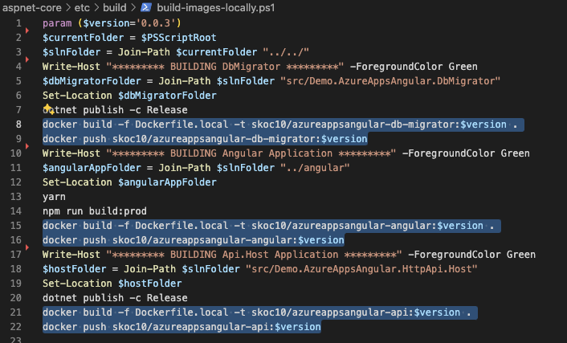
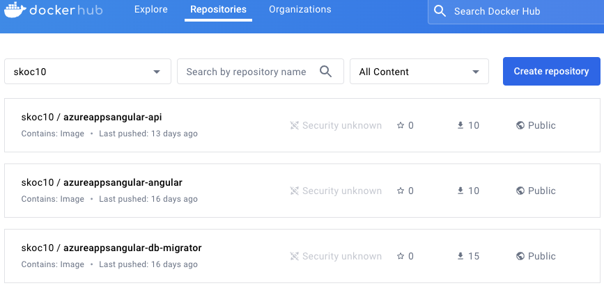
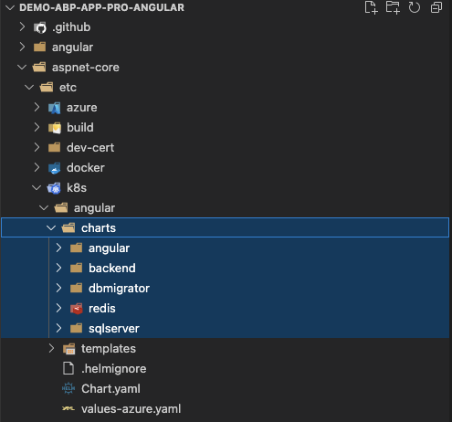

# Deploy Your ABP Framework Angular Project to Azure Kubernetes Service (AKS)

In my previous article on [deploying an ABP Framework Angular project to Azure App Service](https://docs.abp.io/en/abp/latest/Deployment/Azure-App-Service), I talked about how ABP Mvc project can be easily deployed to Azure App Service. Now I will show how we can deploy to kubernetes environment, which looks a bit more complex but is more preferred for production, using helm chart.

### Getting Started with ABP Framework Angular and Azure Kubernetes Service

To get started, you will need an ABP Framework Angular project that you want to deploy. If you don't have one, you can [create a new project using the ABP CLI](https://docs.abp.io/en/abp/latest/Startup-Templates/Application). You will also need [an Azure subscription](https://azure.microsoft.com) and [an Azure Kubernetes Service](https://azure.microsoft.com/en-gb/services/kubernetes-service/).

If you have your ABP Framework Angular project and Azure kubernetes cluster ready, we can start to build the docker images and pushing them to any container registry. In this article, I will use DockerHub as the container registry.

I will also show you how I automated the steps that I originally did manually to make it simpler in the beginning and then automated them in Azure Devops.

### Creating a Docker Image for ABP Framework Angular

To create a Docker image for your ABP Framework Angular project, navigate to `etc/build/build-images-locally.ps1` and fix the script to match your Docker Hub username and image name. Then, run the script to build the Docker image locally.

At the end of this process, check your Docker Hub repository to confirm that the image has been pushed successfully. My Docker Hub repository looks like this. Also you can use these my public images to test the deployment.

### Creating Helm Chart for ABP Framework Angular

To deploy your ABP Framework Angular project to Azure Kubernetes Service, you need to create a Helm chart. Helm is a package manager for Kubernetes that allows you to define, install, and upgrade even the most complex Kubernetes applications. Helm uses a packaging format called charts, which are a collection of files that describe a related set of Kubernetes resources.

These helm charts are prepared to create a deployment, configmap, service and ingress for your ABP Framework Angular project. It is prepared not only for migration, frontend and backend, but also to create the sqlserver and redis that the application needs as a kubernetes service.

You can find the helm chart in the `https://github.com/skoc10/k8s_works/tree/main/demo/helm/k8s/angular` repository. You can configure the values.yaml file according to your needs. 