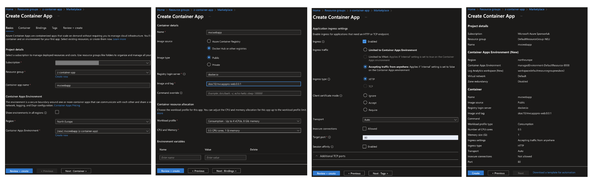
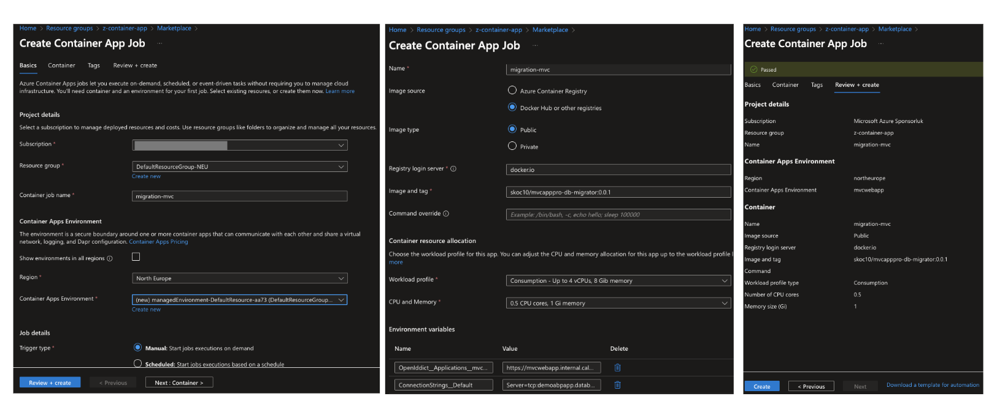

# AZURE CONTAINER APPS DEPLOYMENT WITH ABP

In this article, we explore the seamless deployment of an ABP Framework MVC project to Azure Container Apps. Azure Container Apps is a fully managed Azure service that allows you to deploy and run containerized applications without having to manage the underlying infrastructure. It provides a simple and cost-effective way to deploy and scale your applications.

To get started, you will need an ABP Framework MVC project that you want to deploy. If you don't have one, you can [create a new project using the ABP CLI](https://docs.abp.io/en/abp/latest/Startup-Templates/Application). You will also need [an Azure subscription](https://azure.microsoft.com) and [an Azure SQL database](https://azure.microsoft.com/en-gb/products/azure-sql).

Before creating Azure container apps resources and deploying the ABP Framework MVC project, I show you how you can effortlessly create Docker images and push them to Docker Hub, leveraging the pre-configured Docker file and scripts that come with the ABP MVC framework.

To create a Docker image for your ABP Framework MVC project, navigate to `etc/build/build-images-locally.ps1` and fix the script to match your Docker Hub username and image name. Then, run the script to build the Docker image locally.

Next, check the Docker Hub repository to confirm that the image has been pushed successfully.

Now that you have a Docker image for your ABP Framework MVC project, you can proceed to deploy it to Azure Container Apps. To do this, navigate to the Azure portal and create a new Azure Container Apps resource.

Firstly, create a new Azure Container Apps resource without environment variables. Then, check the deployment status to confirm that the deployment was successful.

Secondly, create a new Azure Container Apps Job resource to migrate the database schema and seed data. You can do this by creating a new job with the following environment variables:

- `ConnectionStrings__Default` - `Server=tcp:demoabpapp.database.windows.net,1433;Initial Catalog=mvcapppro;Persist Security Info=False;User ID=demoapppro;Password={your_password};MultipleActiveResultSets=False;Encrypt=True;TrustServerCertificate=False;Connection Timeout=30;`

- `OpenIddict__Applications__mvcapppro_Web__RootUrl` - `https://mvcwebapp.victoriousgrass-8b06438d.northeurope.azurecontainerapps.io`

Finally, check the job status to confirm that the database migration and seeding were successful. You can connect to the Azure SQL database to verify that the schema and seed data have been applied.

After completing these steps, you have to edit the Azure Container Apps resource to add the required environment variables for your ABP Framework MVC project. You can do this by adding the following environment variables:

- `App__SelfUrl` - `https://mvcwebapp.victoriousgrass-8b06438d.northeurope.azurecontainerapps.io`

- `ASPNETCORE_URLS` - `http://+:80`

- `AuthServer__Authority` - `https://mvcwebapp.victoriousgrass-8b06438d.northeurope.azurecontainerapps.io`

- `ConnectionStrings__Default` - `Server=tcp:demoabpapp.database.windows.net,1433;Initial Catalog=mvcapppro;Persist Security Info=False;User ID=demoapppro;Password={your_password};MultipleActiveResultSets=False;Encrypt=True;TrustServerCertificate=False;Connection Timeout=30;`

You can see the Azure resources created for the ABP Framework MVC project deployment that includes the Azure Container Apps resource, Azure Container Apps Job resource, and Azure SQL database.

Once you have added the environment variables, save and create a new deployment to apply the changes. You can now access your ABP Framework MVC project running on Azure Container Apps by navigating to the URL provided in the environment variables.

In conclusion, Azure Container Apps provides a simple and cost-effective way to deploy and scale your ABP Framework MVC projects without having to manage the underlying infrastructure. By following the steps outlined in this article, you can seamlessly deploy your ABP Framework MVC projects to Azure Container Apps and take advantage of the benefits it offers.

I hope you found this article helpful. If you have any questions or feedback, please feel free to leave a comment below.
